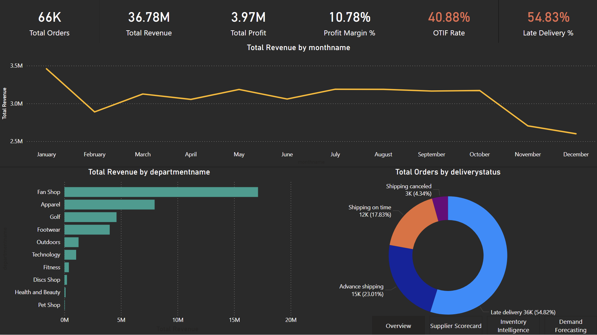
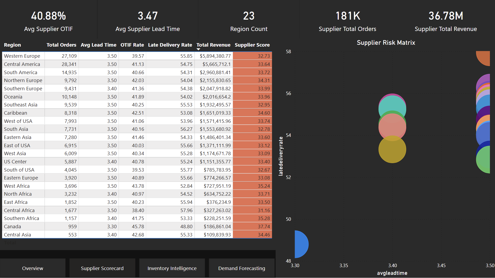
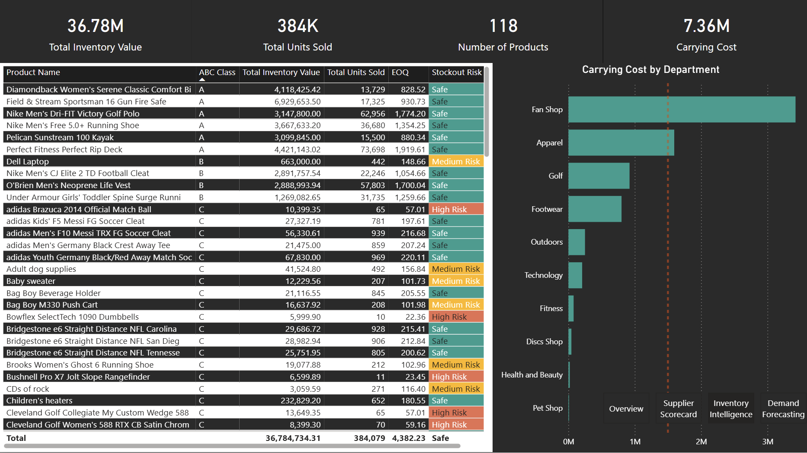
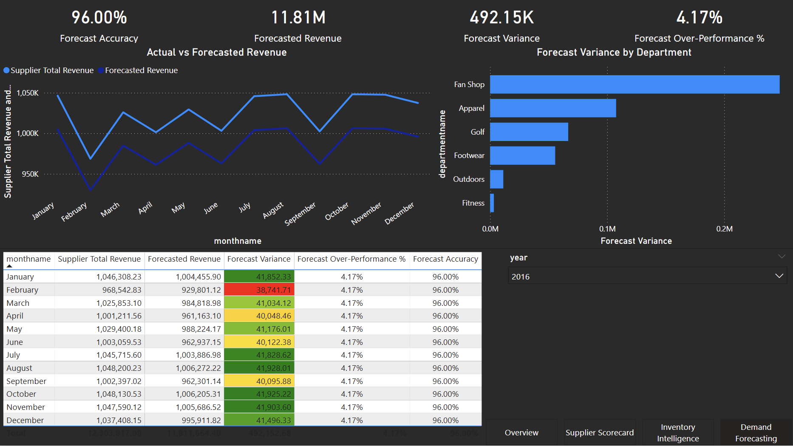

# Supply Chain & Inventory Analytics Dashboard

> End-to-end Power BI dashboard analyzing 181K+ supply chain orders across 23 global regions — covering supplier performance, inventory intelligence, and demand forecasting using PostgreSQL, DAX, and Power BI.

---

## Dashboard Preview

### Page 1 — Overview


### Page 2 — Supplier Scorecard


### Page 3 — Inventory Intelligence


### Page 4 — Demand Forecasting


---

## Project Objective

Analyze a real-world supply chain dataset to:
- Track supplier performance across 23 global regions using OTIF rate, lead time, and delivery status
- Classify products using ABC analysis and identify stockout risk using EOQ modeling
- Build a seasonal demand forecast based on historical revenue patterns
- Deliver findings through a 4-page interactive Power BI dashboard with dark theme and cross-page navigation

---

## Key Insights

| Insight | Finding |
|---|---|
| Total Revenue | **$36.78M** across 181K+ orders |
| Total Profit | **$3.97M** with 10.78% profit margin |
| OTIF Rate | Only **40.88%** — majority of orders are not on time and in full |
| Late Delivery | **54.83%** of orders arrive late — critical operational risk |
| Top Department | **Fan Shop** leads revenue across all departments |
| Avg Supplier Lead Time | **3.47 days** across 23 regions |
| Total Inventory Value | **$36.78M** across 118 products |
| Total Units Sold | **384K** units |
| Carrying Cost | **$7.36M** total inventory carrying cost |
| Forecast Accuracy | **96%** (2016 seasonal baseline model) |

---

## Dashboard Pages

### Page 1 — Overview
- KPI Cards: Total Orders, Total Revenue, Total Profit, Profit Margin %, OTIF Rate, Late Delivery %
- Line Chart: Monthly Revenue Trend by Year (2015–2018)
- Bar Chart: Total Revenue by Department
- Donut Chart: Order Distribution by Delivery Status

### Page 2 — Supplier Scorecard
- KPI Cards: Avg Supplier OTIF, Avg Lead Time, Region Count, Total Orders, Total Revenue
- Table: Region-level breakdown (Orders, Lead Time, OTIF Rate, Late Delivery Rate, Revenue, Supplier Score)
- Scatter Chart: Supplier Risk Matrix (Lead Time vs Late Delivery Rate by Region)

### Page 3 — Inventory Intelligence
- KPI Cards: Total Inventory Value, Total Units Sold, Number of Products, Carrying Cost
- Table: Product-level ABC Classification with EOQ and Stockout Risk (Safe / Medium Risk / High Risk)
- Bar Chart: Carrying Cost by Department
- Conditional formatting: color-coded risk levels (green/orange/red)

### Page 4 — Demand Forecasting
- KPI Cards: Forecast Accuracy, Forecasted Revenue, Forecast Variance, Forecast Over-Performance %
- Line Chart: Actual vs Forecasted Revenue by Month
- Bar Chart: Forecast Variance by Department
- Table: Monthly breakdown (Actual, Forecast, Variance, Over-Performance %, Accuracy)
- Year Slicer for dynamic filtering

---

## Tech Stack

| Tool | Usage |
|---|---|
| **PostgreSQL 18** | Data storage, star schema modeling, date dimension rebuild |
| **TablePlus** | Database management and SQL execution |
| **Power BI Desktop** | Dashboard design, DAX measures, visualizations |
| **DAX** | KPI measures, MoM%, YoY%, ABC classification, EOQ, Safety Stock, Forecast |
| **Parallels (Windows VM)** | Running Power BI on Mac M1 |

---

## Data Model

Star schema with the following tables:

```
fact_orders (181K+ rows)
    ├── dim_date        (datekey — daily calendar 2015–2018)
    ├── dim_product     (productid, ABC class, category, department)
    ├── dim_customer    (customerid, region, market)
    ├── dim_department  (departmentid, departmentname)
    └── supplier_scorecard (region, OTIF, lead time, supplier score)
```

---

## Key DAX Measures

```dax
-- MoM% with data gap handling
Supplier Total Revenue MoM% =
DIVIDE([Current Month Revenue] - [Previous Month Revenue], [Previous Month Revenue], 0)

-- YoY% with same-period comparison
YoY Growth =
DIVIDE([Current Year Revenue] - [Previous Year Revenue], [Previous Year Revenue], 0)

-- ABC Classification
ABC Class =
VAR CumulativeRevenue = ...
RETURN
IF(CumulativeRevenue <= 0.8, "A", IF(CumulativeRevenue <= 0.95, "B", "C"))

-- EOQ (Economic Order Quantity)
EOQ =
SQRT(DIVIDE(2 * [Annual Demand] * [Order Cost], [Holding Cost Per Unit]))

-- Stockout Risk
Stockout Risk =
IF([EOQ] < 100, "High Risk", IF([EOQ] < 500, "Medium Risk", "Safe"))

-- Seasonal Demand Forecast
Forecasted Revenue =
VAR MonthlyForecast =
    CALCULATE([Supplier Total Revenue],
        REMOVEFILTERS('public dim_date'[year]),
        'public dim_date'[year] = 2016,
        'public dim_date'[month] = SelectedMonth
    ) * 0.96
RETURN IF(ISBLANK(SelectedMonth), AnnualForecast, MonthlyForecast)
```

---

## Project Structure

```
supply-chain-analytics/
│
├── screenshots/
│   ├── page1_overview.png
│   ├── page2_supplier_scorecard.png
│   ├── page3_inventory_intelligence.png
│   └── page4_demand_forecasting.png
│
├── sql/
│   ├── create_tables.sql           # Star schema DDL
│   ├── dim_date_rebuild.sql        # Daily calendar rebuild (fixes weekly dim_date)
│   └── analysis_queries.sql        # Key SQL analysis queries
│
├── dax/
│   └── measures.md                 # All DAX measures documented
│
├── SupplyChainDashboard.pbix       # Power BI report file
│
└── README.md
```

---

## How to Run

### 1. Setup PostgreSQL Database

```bash
psql -U postgres -c "CREATE DATABASE supply_chain_intelligence;"
```

### 2. Create Star Schema Tables

```bash
psql -U postgres -d supply_chain_intelligence -f sql/create_tables.sql
```

### 3. Rebuild Daily Date Dimension

```sql
TRUNCATE TABLE public.dim_date;

INSERT INTO public.dim_date (datekey, date, year, quarter, month, monthname, monthshort, week, dayofweek, yearmonth, isweekend)
SELECT
    TO_CHAR(d, 'YYYYMMDD')::INT,
    d,
    EXTRACT(YEAR FROM d)::INT,
    EXTRACT(QUARTER FROM d)::INT,
    EXTRACT(MONTH FROM d)::INT,
    TO_CHAR(d, 'Month'),
    TO_CHAR(d, 'Mon'),
    EXTRACT(WEEK FROM d)::INT,
    EXTRACT(DOW FROM d)::INT,
    TO_CHAR(d, 'YYYYMM')::INT,
    EXTRACT(DOW FROM d) IN (0,6)
FROM GENERATE_SERIES('2015-01-01'::DATE, '2018-12-31'::DATE, '1 day') AS d;
```

### 4. Connect Power BI

- Open `SupplyChainDashboard.pbix`
- Update PostgreSQL connection: `Host: 127.0.0.1`, `Port: 5432`, `Database: supply_chain_intelligence`
- Refresh data

---

## Dataset

- **Source:** [DataCo Supply Chain Dataset — Kaggle](https://www.kaggle.com/datasets/shashwatwork/dataco-smart-supply-chain-for-big-data-analysis)
- **Size:** 181,000+ rows
- **Coverage:** 2015–2018, 23 global regions, 118 products, 10 departments

---

## Technical Challenges Solved

| Challenge | Solution |
|---|---|
| Weekly `dim_date` breaking all time intelligence | Rebuilt as daily calendar using `GENERATE_SERIES` |
| MoM% returning blank due to data gaps | Used `MAX(order_datekey)` fallback instead of `MAX(dim_date[year])` |
| YoY comparing partial 2018 vs full 2017 | Hardcoded `LastCompleteYear = 2017` for fair comparison |
| Product YoY context loss in bar chart | Used `TREATAS` + `SUM` directly instead of measure reference |
| Forecast flat line on chart | Separated annual vs monthly forecast logic using `ISBLANK(SelectedMonth)` |

---

## Author

**Wagih Emad (Goose)**
BI Developer | Data Analyst
[github.com/goose006567](https://github.com/goose006567)

> *Building data-driven supply chain solutions — from raw PostgreSQL data to executive-ready Power BI dashboards.*
